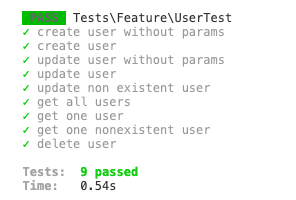

## Backend

### Tecnologias
* PHP 7.4
* Laravel 8

### Configurações

Insira os dados do seu banco de dados Mongo DB no `.env`. 
Segue um Exemplo abaixo:

```
DB_CONNECTION=mongodb
DB_HOST=127.0.0.1
DB_PORT=27017
DB_DATABASE=amigosecreto
DB_USERNAME=
DB_PASSWORD=
#Dados do MailGUN
MAIL_SECRET=
MAIL_DOMAIN=
```


### Setup
* ```composer install```
* ```php artisan db:seed```

### Rodando a aplicação
* ```php artisan serve```

### Rodando os testes
* ```php artisan test```




## Frontend

### Tecnologias
* Javascript
* ReactJS

### Configurações

Crie um arquivo .env com a informação `REACT_APP_API` apontando para o seu servidor.

```
REACT_APP_API=http://127.0.0.1:8000/api
```

### Setup
* ```yarn install``` ou ```npm install```


### Rodando a aplicação
* ```yarn start``` ou ```npm start```
