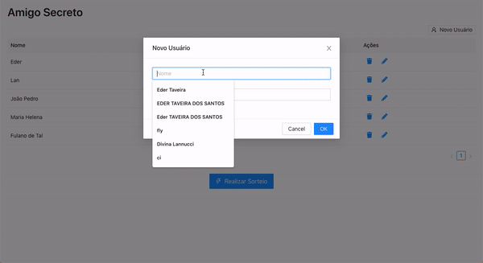

## Funcionalidades

1. Cadastro de Usuários.
2. Edição de Usuário.
3. Exclusão de um usuário.
4. Validação de nome e email.
5. Realização do Sorteio.
6. Tratamento de erro quando um usuário tira ele mesmo como amigo secreto (realizando um novo sorteio automaticamente até que isso não aconteça).

## App em produção

O endereço para acessar o app em produção é: [https://amigosecret.herokuapp.com/](https://amigosecret.herokuapp.com/). 
Para realizar e verificar um teste basta colocar usuários usando os emails: `shimeny.s@adireto.com` ou `marciana.b@adireto.com`.

Utilizamos uma conta gratuita do mailgun para envio de emails, portanto caso preciso de mais emails, favor informar para inclusão.



## Backend

### Tecnologias
* PHP 7.4
* Laravel 8

### Configurações

Insira os dados do seu banco de dados Mongo DB no `.env`. 
Segue um Exemplo abaixo:

```
DB_CONNECTION=mongodb
DB_HOST=127.0.0.1
DB_PORT=27017
DB_DATABASE=amigosecreto
DB_USERNAME=
DB_PASSWORD=
```

Insira também os dados do mailgum:

```
MAIL_SECRET=
MAIL_DOMAIN=
```

### Setup
* ```composer install```
* ```php artisan db:seed``` (Opcional caso queira que seja incluso dados padrão no banco de dados)


### Rodando a aplicação
* ```php artisan serve```

### Rodando os testes
* ```php artisan test```


## Frontend

### Tecnologias
* Javascript
* ReactJS

### Configurações

Crie um arquivo .env com a informação `REACT_APP_API` apontando para o seu servidor.

```
REACT_APP_API=http://127.0.0.1:8000/api
```

### Setup
* ```yarn install``` ou ```npm install```


### Rodando a aplicação
* ```yarn start``` ou ```npm start```
